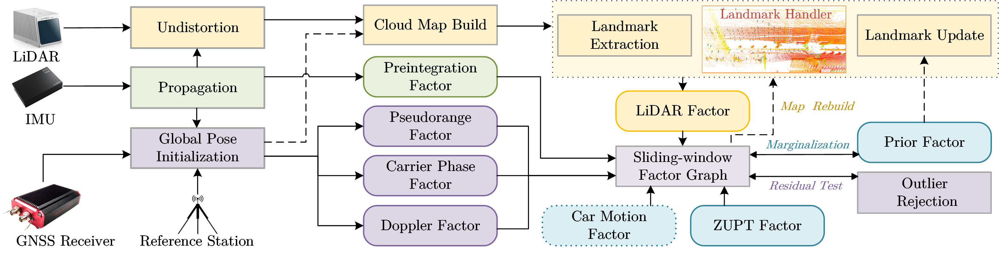

# GLINS

GLINS is a GNSS-LiDAR-INS integrated navigation system for accurate and reliable navigation in challenging urban environments. GLINS jointly optimizes GNSS measurements, LiDAR landmarks, and inertial states in a unified factor graph. This repository currently provides an overview of the system, **Code is coming soon.**

## Highlights

- Tightly coupled GNSS-LiDAR-INS fusion in a unified optimization framework
- Joint landmark-state formulation for consistency under GNSS corrections

## Pipeline



## Authors

Jiahui Liu, Cheng Chi, Xin Zhang, Binlin Zhang, Dongen Li, Xingqun Zhan, and Marcelo H. Ang Jr.

## Related Papers

J. Liu, C. Chi, X. Zhang, B. Zhang, D. Li, X. Zhan and M. H. Ang Jr., "GLINS: GNSS-LiDAR-INS Integrated Navigation System," in IEEE Robotics and Automation Letters, accepted, Mar. 2026.

C. Chi, X. Zhang, J. Liu, Y. Sun, Z. Zhang and X. Zhan, "GICI-LIB: A GNSS/INS/Camera Integrated Navigation Library," in IEEE Robotics and Automation Letters, vol. 8, no. 12, pp. 7970-7977, Dec. 2023, doi: 10.1109/LRA.2023.3324825.

## Video Demo


More demo videos and materials will be released soon.

## Dataset

Our LiDAR data was collected together with GICI. Please refer to the following public dataset repository for related data resources:

- [GICI Open Dataset](https://github.com/chichengcn/gici-open-dataset)

## Dependencies

### 1.1 Ubuntu

We are developing our code on Ubuntu 22.04, and tested on Ubuntu 20.04 and Ubuntu 24.04. We recommend you use the same or a similar environment if you are not familiar with cross-compiling.

### 1.2 Eigen 3.3 or later. REQUIRED.

Eigen is a C++ template library for linear algebra. You can find the releases on [Eigen](https://eigen.tuxfamily.org/).

### 1.3 OpenCV 4.2.0 or later. REQUIRED.

OpenCV is a computer vision library. You can find the releases on [OpenCV](https://opencv.org/releases/).

### 1.4 yaml-cpp 0.6.0 or later. REQUIRED.

yaml-cpp is a decoder and encoder for YAML formats. We use YAML files to configure the workflow. You can find the releases on [yaml-cpp](https://github.com/jbeder/yaml-cpp).

### 1.5 glog 0.6.0 or later. REQUIRED.

glog is a logging control library. You can find the releases on [glog](https://github.com/google/glog). You should install glog together with gflags. We suggest you install glog from source code rather than apt-get, because installing from apt-get may make GLINS fail to find the glog library during compiling.

### 1.6 Ceres-Solver 2.1.0 or later. REQUIRED.

Ceres-Solver is a nonlinear optimization library. You can find the releases on [Ceres-Solver](http://ceres-solver.org/).

### 1.7 PCL 1.12 or later. REQUIRED.

PCL is a library for point cloud processing. GLINS relies on PCL for LiDAR point cloud representation and geometric processing. Please make sure your installed PCL version is 1.12 or later. You can find the releases on [PCL](https://pointclouds.org/).

### 1.8 ROS 1. REQUIRED.

ROS is a software framework for robot applications. GLINS currently depends on ROS 1 for message transport, sensor interfaces, and runtime integration. Please make sure a ROS 1 distribution is properly installed in your environment.

### 1.9 livox_ros_driver. REQUIRED.

livox_ros_driver is required for handling Livox LiDAR data streams in ROS. Please install the driver before building or running GLINS with Livox sensors. You can find the source code and installation instructions on [livox_ros_driver](https://github.com/Livox-SDK/livox_ros_driver).

## Build

Currently, the LiDAR-related modules in GLINS only support building and running with ROS. Therefore, please make sure that ROS 1 and the required LiDAR driver have been properly installed before compiling GLINS.

### 2.1 Build with ROS

```bash
cd <glins-root-directory>/ros_wrapper
catkin_make -DCMAKE_BUILD_TYPE=Release
source ./devel/setup.bash
```

Now you can run GLINS via
```bash
rosrun gici_ros gici_ros_main <gici-config-file>
```

## Acknowledgements

Many of the GNSS tools, I/O handlers, and message de/encoders in GLINS are inherited from [GICI](https://github.com/chichengcn/gici-open). The implementation of the IMU factor is inspired by [OKVIS](https://github.com/ethz-asl/okvis). The point cloud processing pipeline is developed with reference to [FAST-LIVO2](https://github.com/hku-mars/FAST-LIVO2).
